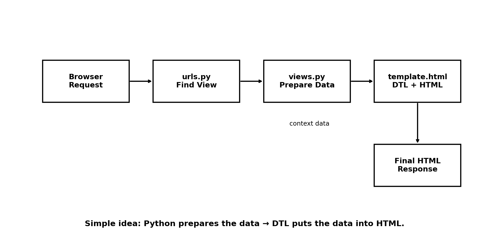
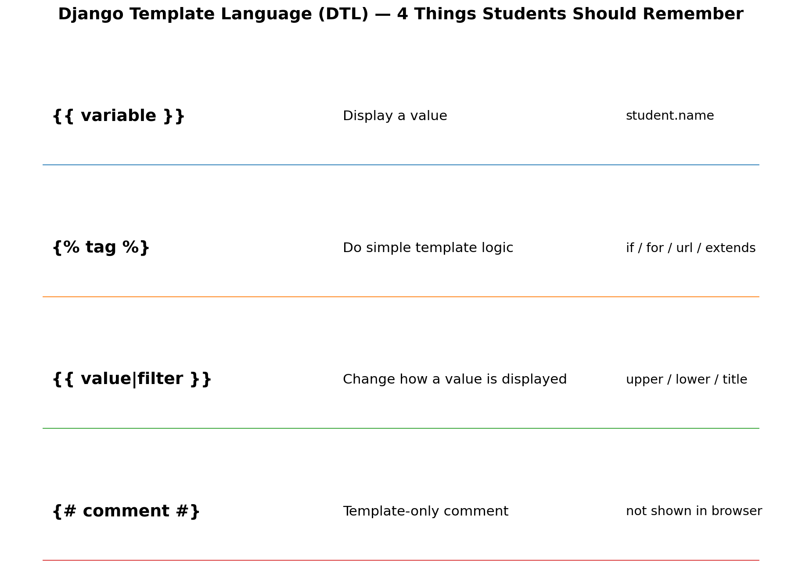

# Django Project No. 0006 — Django Template Language (DTL)

## 🎯 Project Name

**Django Template Language — Display Dynamic Data Using HTML Templates**

---

# 🎯 Project Objective

In this project, we will learn **Django Template Language (DTL)** in simple steps.

We will learn how to:

- Create a Django project
- Create a Django application
- Create an HTML template
- Connect a view with a template
- Send data from `views.py` to an HTML template
- Display variables using `{{ }}` 

> **Simple definition:**  
> **Django Template Language (DTL) is the language we use inside Django HTML templates to display and control dynamic data.**

Django's template system is designed for presentation rather than arbitrary Python logic. It provides variables, tags, filters, comments, and template inheritance. citeturn0search0

---

# 🖼️ DTL Request Flow



The basic idea is:

```text
Browser
   ↓
urls.py
   ↓
views.py
   ↓
Prepare data
   ↓
HTML Template + DTL
   ↓
Final HTML
   ↓
Browser
```

The view prepares the data, and the template decides how that data should be displayed.

---

# 🖼️ DTL Syntax Cheat Sheet



The four important DTL forms are:

```text
{{ variable }}

{{ value|filter }}
{# comment #}
```

---

# Daily Common Setup

## 1. Create the CampusQuest Project

Open Command Prompt:

```cmd
cd Desktop

mkdir CampusQuest

cd CampusQuest

python -m venv venv

venv\Scripts\activate

python -m pip install --upgrade pip

notepad requirements.txt
```

---

## 2. Add Dependencies to `requirements.txt`

```text
Django
djangorestframework
mysqlclient
python-dotenv
```

Save the file.

---

## 3. Install Dependencies

```cmd
python -m pip install -r requirements.txt
```

---

# Django Project Setup

## 📌 Step 1: Create the Django Project

```bash
django-admin startproject DTLProject
```

---

## 📌 Step 2: Enter the Project Directory

```bash
cd DTLProject
```

---

## 📌 Step 3: Create the Django Application

```bash
py manage.py startapp App1
```

---

# 📌 Step 4: Register the Application

Open:

```text
DTLProject/DTLProject/settings.py
```

Add `App1`:

```python
INSTALLED_APPS = [
    'django.contrib.admin',
    'django.contrib.auth',
    'django.contrib.contenttypes',
    'django.contrib.sessions',
    'django.contrib.messages',
    'django.contrib.staticfiles',

    'App1',
]
```

---

# 📌 Step 5: Create the Templates Folder

Inside the application, create:

```text
App1/
│
├── templates/
│   └── App1/
│       └── student.html
│
└── views.py
```

The recommended structure keeps the template associated with the application:

```text
App1/templates/App1/student.html
```

---

# 📌 Step 6: Create the View

Open:

```text
App1/views.py
```

Add:

```python
from django.shortcuts import render


def student(request):

    context = {
        'name': 'Rahul',
        'age': 21,
        'course': 'Django',
        'city': 'Bangalore',
        'marks': 85,
    }

    return render(request, 'App1/student.html', context)
```

---

# 🧠 What Is `context`?

The `context` is the data that we send from the view to the template.

Here:

```python
context = {
    'name': 'Rahul',
    'age': 21,
    'course': 'Django',
    'city': 'Bangalore',
    'marks': 85,
}
```

We are sending:

```text
name   → Rahul
age    → 21
course → Django
city   → Bangalore
marks  → 85
```

The template can use these values.

---

# 📌 Step 7: Create the Template

Create:

```text
App1/templates/App1/student.html
```

Add:

```html
<!DOCTYPE html>
<html>
<head>
    <title>Student Profile</title>
</head>

<body>

    <h1>Student Profile</h1>

    <h2>Name: {{ name }}</h2>

    <p>Age: {{ age }}</p>

    <p>Course: {{ course }}</p>

    <p>City: {{ city }}</p>

    <p>Marks: {{ marks }}</p>

</body>
</html>
```

---

# 🧠 The Most Important DTL Syntax: `{{ }}`

When we write:

```html
{{ name }}
```

Django replaces it with the value of `name`.

The view sends:

```python
'name': 'Rahul'
```

The template contains:

```html
{{ name }}
```

The browser receives:

```html
Rahul
```

So:

```text
Python data
     ↓
'name': 'Rahul'
     ↓
{{ name }}
     ↓
Rahul
```

---

# 📌 Step 8: Create Application-Level `urls.py`

Create:

```text
App1/urls.py
```

Add:

```python
from django.urls import path
from . import views


urlpatterns = [
    path('student/', views.student),
]
```

---

# 📌 Step 9: Configure Project-Level `urls.py`

Open:

```text
DTLProject/DTLProject/urls.py
```

Add:

```python
from django.contrib import admin
from django.urls import path, include


urlpatterns = [
    path('admin/', admin.site.urls),

    path('App1/', include('App1.urls')),
]
```

---

# 📌 Step 10: Run the Server

```bash
py manage.py runserver
```

Open:

```text
http://127.0.0.1:8000/App1/student/
```

You should see:

```text
Student Profile

Name: Rahul
Age: 21
Course: Django
City: Bangalore
Marks: 85
```